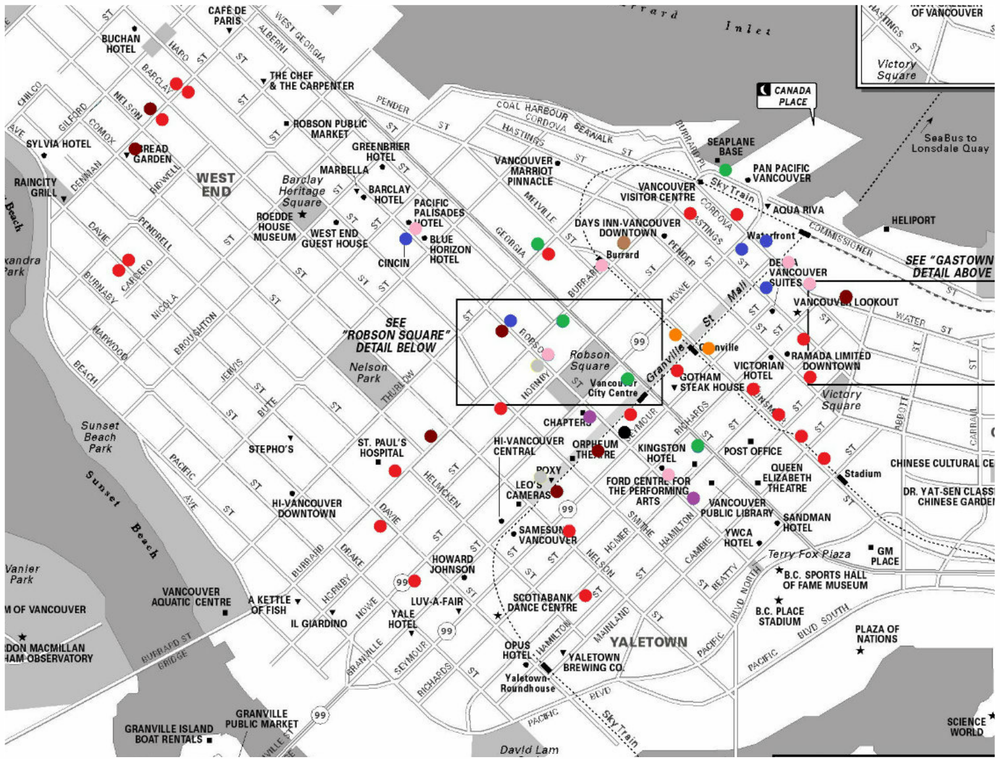

# Benny's Landing Page
Benny Wai  
October 26, 2016  

## Introduction

Greetings! I am a master's student in Operations Research at Simon Fraser University. I specialize in optimisation and data science. I am often working on various projects as a part of my academic career or for self-interest. 

Linkedin account: https://www.linkedin.com/in/benny-wai-26a5bb11a

Computer languages and programs I know: matlab, java, C++, python, R, SAS, excel open solver, latex.

Computer languages and programs that I want to learn: tableau, SQL

## Current projects:

- [Master's Thesis] Optimising HIV treatment, care, & testing programs in Vancouver, BC. 

This project looks at understanding the entire HIV continuum of care in Vancouver to find the optimal allocation of budget for testing, care, & treatment programs to minimize HIV morbidity, mortality, and number of infections. This ongoing project uses a large ODE epidemic compartment model to represent the continuum of care. We work closely with Vancouver Coastal Health and Providence Health to ensure the model actually reflects what occurs in practice.

- Predicting student course failure at Simon Fraser University using machine learning.

Below is a plot of a dimension reduction visualisation technique called "t-distributed stochastic neighbor embedding" applied on student grades of a numerical analysis course at Simon Fraser University. Different colors were used to represent various segregation of grades achieved in the course, and also highlights the natural clusters formed. R is currently being used to prepare data and run analysis. 

## Previous projects: 

- Optimisation of food truck locations in downtown, Vancouver. 

This 4 month project during my undergraduate degree was to find optimal locations for food trucks based on maximizing accessibility for pedestrains as well as to minimize conflicts with brick-and-mortar restaurants. Below is a map showing the results of the non-linear mixed integer model, with various colors representing different food types that the food trucks provide.

- Canadian criminal justice system: simulation

I helped create a simulation of the criminal justice system in matlab (using simulink). This was a part of a larger project ran by my supervisor. 

- Identifying frequent users of the emergency department

As a part of a special course project during my undergradute degree, I worked at Fraser Health Authority to try to identify frequent users of the emergency department at hospitals using machine learning. K-means and hierarchy clustering was used and done in R & SAS.
