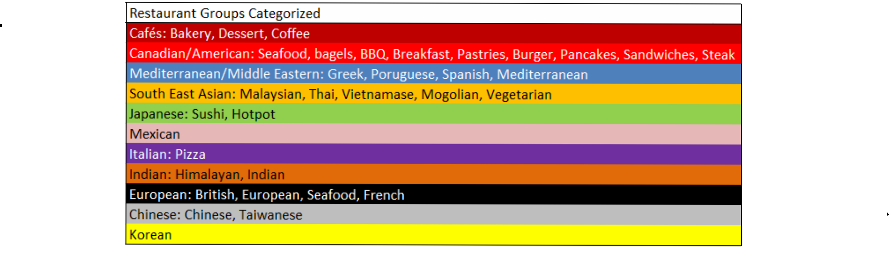

# Benny's Landing Page
Benny Wai  
January 1st, 2018

## Introduction

Greetings! I specialize in data science and optimization. I have worked on projects with various organizations using real data, including Vancouver Coastal Health Authority, Providence Health, Translink, Simon Fraser University, and Fraser Health Authority. I have a master's degree in Operations Research.

Linkedin account: https://www.linkedin.com/in/benny-ask-me-wai

Computer languages and programs I know: python, R, SQL, Tableau, C++, matlab, java, SAS, excel open solver, latex, SPARQL, Visual Paradigm

Computer languages and programs I am currently learning about: Hadoop, Azure

## Previous projects: 

- TransLink twitter sentiment analysis and bus delay analysis project

I have worked on this project as apart of the Applied Quantitative Methods group. We developed a sentiment classifer for TransLink tweets that achieved state-of-the-art results, as well as clustered bus delays to categorize/predict various types of delays prevalent in Vancouver, BC.

Below is 3 tweet topics identified using Latent Dirichlet allocation

- [Master's Thesis] Optimising HIV treatment, care, & testing programs in Vancouver, BC. 

This project looks at understanding the entire HIV continuum of care in Vancouver to find the optimal allocation of budget for testing, care, & treatment programs to minimize HIV morbidity, mortality, and number of infections. This ongoing project uses a large ODE epidemic compartment model to represent the continuum of care. We work closely with Vancouver Coastal Health and Providence Health to ensure the model actually reflects what occurs in practice.

Below is a UML diagram of the system of ODEs that represent the entire Vancouver healthcare system for HIV patients.

- Predicting student course failure at Simon Fraser University using machine learning.

Below is a plot of a dimension reduction visualisation technique called "t-distributed stochastic neighbor embedding" applied on student grades of a numerical analysis course at Simon Fraser University. Different colors were used to represent various segregation of grades achieved in the course, and also highlights the natural clusters formed. R is currently being used to prepare data and run analysis. 

- Optimization of food truck locations in downtown, Vancouver. 

This 4 month project during my undergraduate degree was to find optimal locations for food trucks based on maximizing accessibility for pedestrains as well as to minimize conflicts with brick-and-mortar restaurants. Below is a map showing the results of the non-linear mixed integer model, with various colors representing different food types that the food trucks provide.

- Canadian criminal justice system: simulation

I helped create a simulation of the criminal justice system in matlab (using simulink). This was a part of a larger project ran by my supervisor. 

- Identifying frequent users of the emergency department

As a part of a special course project during my undergradute degree, I worked at Fraser Health Authority to try to identify frequent users of the emergency department at hospitals using machine learning. K-means and hierarchy clustering was used and done in R & SAS.
